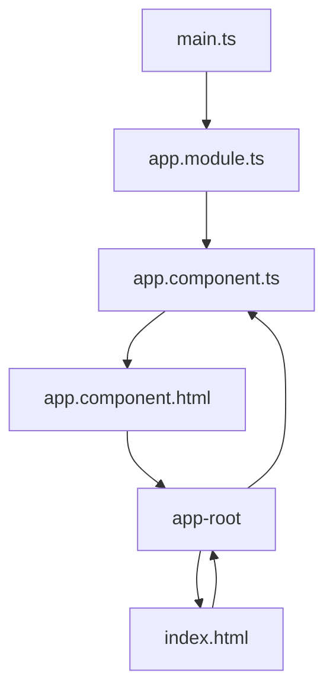

# How an Angular App gets Loaded and Started

要知道 Angular 如何載入 html 的話，我們必須先看到 `src/` 底下的 `index.html` 檔案：

- [`./src/index.html`](../../my-first-app/src/index.html)

```html
<!doctype html>
<html lang="en">
<head>
  <meta charset="utf-8">
  <title>MyFirstApp</title>
  <base href="/">
  <meta name="viewport" content="width=device-width, initial-scale=1">
  <link rel="icon" type="image/x-icon" href="favicon.ico">
</head>
<body>
  <app-root>Loading...</app-root>
</body>
</html>
```

其中我們可以發現 `<app-root>` 這個特別的 element，先把它記在心裡，讓我們繼續看到 `app.component.ts` 這個 TypeScript 檔案：

- [`./src/app/app.component.ts`](../../my-first-app/src/app/app.component.ts)

```ts
import { Component } from '@angular/core';

@Component({
  selector: 'app-root',
  templateUrl: './app.component.html',
  styleUrls: ['./app.component.css']
})
export class AppComponent {
  title = 'my-first-app';
}
```

其中我們可以發現 `selector: 'app-root'`，這個 selector 就是我們指向 `index.html` 裡面的 `<app-root>` element。

所以當 Angular 載入 `index.html` 的時候，會去找到 `app.component.ts` 這個檔案，並且把 `teplateUrl` 指向的 html 內容（即 `./app.component.html` ）放到 `<app-root>` 這個 element 裡面。

## How is Angular Triggered

Angular 是如何觸發的？ 它是如何啟動並運行在我們這個 `index.html` 檔案中的呢？

我們可以通過右鍵 `View Page Source` 檢查這些原始程式碼來發現在最後有幾個 script 引入：

```html
<!doctype html>
<html lang="en">
<head>
  ...
<script src="runtime.js" type="module"></script><script src="polyfills.js" type="module"></script><script src="styles.js" defer></script><script src="vendor.js" type="module"></script><script src="main.js" type="module"></script></body>
</html>
```

這些是由 CLI 自動注入的。

所以這就是為什麼我們在原始的 `index.html` 檔案中看不到它。

但每當這個 `ng serve` 過程重建我們的專案時，它將創建 JavaScript script 捆綁，並自動在 `index.html` 檔案中添加正確的引入。

而且它們實際上是第一個被執行的程式碼，這是你必須牢記的一點，就是我們在 `main.ts` 檔案中撰寫的程式碼。 這就是為什麼它被稱為 `main` 。 現在讓我們仔細看看它。

## The `main.ts` File

- [`./src/main.ts`](../../my-first-app/src/main.ts)

```ts
import { platformBrowserDynamic } from '@angular/platform-browser-dynamic';

import { AppModule } from './app/app.module';


platformBrowserDynamic().bootstrapModule(AppModule)
  .catch(err => console.error(err));
```

其中最重要的是這一行：

```ts
platformBrowserDynamic().bootstrapModule(AppModule)
  .catch(err => console.error(err));
```

這個「Bootstrap」開始我們的 Angular 應用程式

通過將 `AppModule` 傳遞給這個方法，而 `AppModule` 引用了 [`./app/app.module`](../../my-first-app/src/app/app.module.ts) 這個檔案。

現在，如果我們看一下這個檔案，在這裡，我們看到組件有這個奇怪的 `@` 符號。

稍後我將在幾堂課中深入探討這個問題。

但對於現在來說，最重要的是，在這裡我們有這個 `bootstrap` 陣列：

- [`./app/app.module`](../../my-first-app/src/app/app.module.ts)

```ts
@NgModule({
  ...
  bootstrap: [AppComponent]
})
```

它基本上列出了所有應該為 Angular 所知的組件，在它分析我們的 `index.html` 檔案的時候。

在這裡，循環關閉了，因為在這裡我們引用了我們的 [`AppComponent`](../../my-first-app/src/app/app.component.ts)。

所以 Angular 開始運作了。

這個 `main.ts` 檔案開始運行。

在那裡，我們引導了一個 Angular 應用程式，並將 [`app.module.ts`](../../my-first-app/src/app/app.module.ts) module 作為參數傳遞。

在這個 module 中，我們告訴 Angular，嘿，這裡有這個 [`AppComponent`](../../my-first-app/src/app/app.component.ts)，當你嘗試啟動自己時應該要知道它。

Angular 現在分析 [`AppComponent`](../../my-first-app/src/app/app.component.ts)，讀取我們在這裡傳遞的設定，

因此知道了這個選擇器 `app-root`。

現在 Angular 能夠在 `index.html` 檔案中處理 `app-root`，因為它在 `app.module` 的 `bootstrap` 陣列中被列出。

所以現在我知道我應該在這裡插入 [`AppComponent`](../../my-first-app/src/app/app.component.ts)。

而且 [`AppComponent`](../../my-first-app/src/app/app.component.ts) 恰好有一些 HTML 程式碼，

附加在它上面的模板，這個 `h3` 標籤就是其中一部分。

這就是 Angular 應用程式在這裡啟動的方式。

## Summary

```mermaid
graph TD;
  
```


