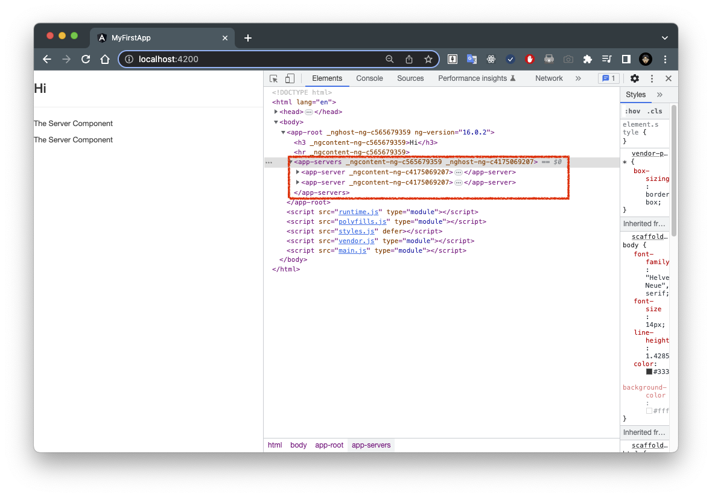

06. Creating Components with the CLI & Nesting Components

我們可以使用一些 CLI 指令來創建新 components。

假設我們想要將單個伺服器 component 嵌套到另一個 component 中，即多個伺服器 component 中。

讓我們用 `ng generate component` 來創建一個名為 `servers` 的新 component：

```shell
ng generate component servers
```

> **Note**: 您也可以使用快捷方式 `ng g c`，它的功能相同。

```
CREATE src/app/servers/servers.component.css (0 bytes)
CREATE src/app/servers/servers.component.html (22 bytes)
CREATE src/app/servers/servers.component.spec.ts (566 bytes)
CREATE src/app/servers/servers.component.ts (206 bytes)
UPDATE src/app/app.module.ts (482 bytes)
```

如果按 `Enter` ，這將在您的 `app` 文件夾中提供一個名為 `servers` 的新文件夾，其中包含與 `app` component 相同的文件，包括 HTML、CSS、TS 和用於測試的 spec 文件。

現在我將刪除這個 spec 文件，我們稍後會介紹有關測試的部分，並稍後再看一下樣式，現在假設我們要在 `servers` component 中輸出我們的單個伺服器。

我們已經有了這個選擇器 `app-server`，所以在 [`servers.component.html`](../../my-first-app/src/app/servers/servers.component.html) 這個 servers component 的模板中，我們可以使用 `app-server` 覆蓋預設的內容，並簡單地複製它，這樣我們就有了兩個 components：

- [`servers.component.html`](../../my-first-app/src/app/servers/servers.component.html)

```html
<app-server></app-server>
<app-server></app-server>
```

> **Note**: 請記住，component 是可重複使用的，我們可以通過多次使用它的選擇器來使用相同的 component 。

現在，我們在這裡有兩個 servers，請確保您也更新了app module，即 [`app.module.ts`](../../my-first-app/src/app/app.module.ts)：

- [`app.module.ts`](../../my-first-app/src/app/app.module.ts)

```ts
...
import { ServersComponent } from './servers/servers.component';

@NgModule({
  declarations: [
    ...
    ServerComponent,
    ServersComponent
  ],
  ...
})
export class AppModule { }
```

> **Note**: CLI 應該會自動幫我們更新，這就是為什麼您已經在該檔案中看到了 import 和宣告，但請確保您確實在這裡有它！

現在，我們可以轉到 [`servers.component.ts`](../../my-first-app/src/app/servers/servers.component.ts) 中檢查選擇器，它是 `app-servers`：

```ts
@Component({
  selector: 'app-servers',
  ...
})
export class ServersComponent {

}
```

然後我們可以轉到 [`app.component.html`](../../my-first-app/src/app/app.component.html) 中更新選擇器，以使用這個新 `app-servers` component 代替舊 `app-server` component 。

- [`app.component.html`](../../my-first-app/src/app/app.component.html)

```html
<h3>Hi</h3>
<hr>
<!-- <app-server></app-server> -->
<app-servers></app-servers>
```

現在，如果我們保存並訪問 `localhost:4200` ，它看起來幾乎與之前一樣，我們可以看到我們的單個伺服器 component 出現兩次，但是如果我們檢查 Chrome 等開發者工具中的程式碼，您將看到外部有我們新創建的 `app-servers` 這個 component，在其中，我們有兩個單獨的 `app-server` component：



因此，通過這一點，我們學到了一些重要的事情，包括如何手動或使用 CLI 創建 component ，如何將它們嵌套到彼此中，我們可以在任何其他 component 的任何其他模板中使用 component 選擇器，以及如何通過多次使用它們的選擇器來複製 component 。

下一小節讓我們深入了解如何設置 component 的樣式和模板。
