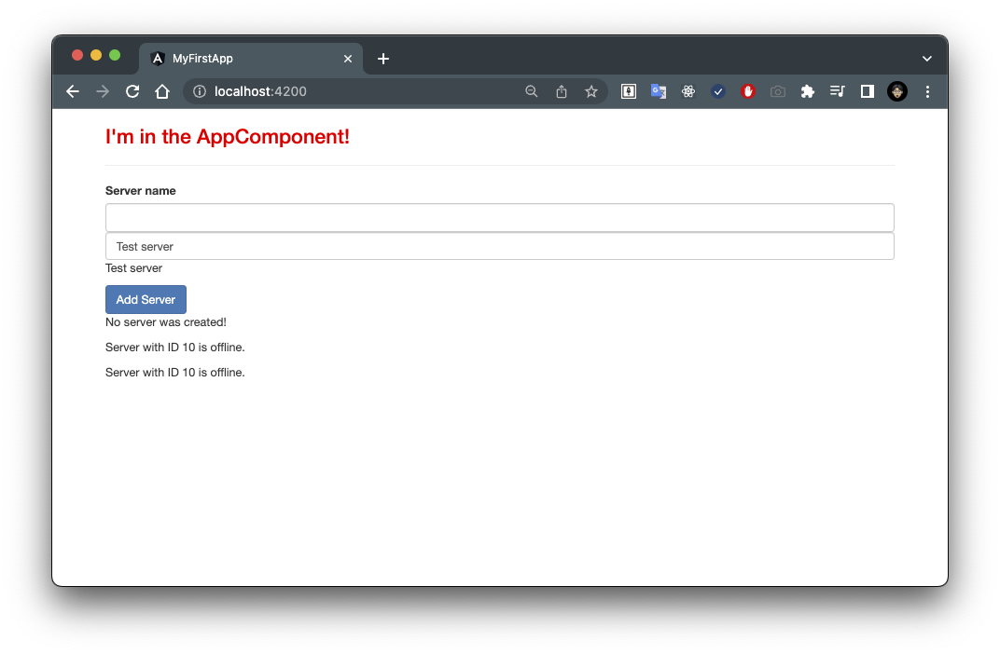

# 17. Two-Way DataBinding

## 💡 `FormsModule` is Required for Two-Way-Binding

> **Important**: 
> `FormsModule` is Required for Two-Way-Binding!

要使用雙向綁定，你需要啟用 `ngModel` 指令。 這可以通過將 `FormsModule` 添加到 `AppModule` 的 `imports` 陣列中來完成。

然後，你還需要在 `app.module.ts` 檔案中從 `@angular/forms` 中導入：

- [`app.module.ts`](../../my-first-app/src/app/app.module.ts)

```ts
import { FormsModule } from '@angular/forms';
...
@NgModule({
  ...
  imports: [
    ...
    FormsModule
  ],
  ...
})
export class AppModule { }
```

## What is Two-Way-Binding

在上一堂課中，我們學習了很多關於事件綁定和屬性綁定的知識。

現在，讓我們將兩者結合起來，實現雙向綁定。

我們學到了可以像下面這樣獲取事件資料：

- [`servers.component.html`](../../my-first-app/src/app/servers/servers.component.html)

```html
<input
  type="text"
  class="form-control"
  (input)="onUpdateServerName($event)">
```

不過，還有另一種方法。

如果我將這個 `input` 事件替換為其他內容，你會發現我們有一種更簡單的綁定資料的方式。

使用「雙向資料綁定」，我們結合了「屬性綁定」和「事件綁定」。

我們通過結合 `[ ]` 方括號和 `( )` 圓括號的 `[( )]` 語法來實現。

在這裡，我們需要使用一個特殊的指令 `ngModel` ，我們將在下一個 NG 模塊中更詳細地介紹該指令。

現在，我們可以將其設置為在我們的 TypeScript 程式碼中定義的某個屬性，比如 `serverName` ：

- [`servers.component.html`](../../my-first-app/src/app/servers/servers.component.html)

```html
<input
  type="text"
  class="form-control"
  [(ngModel)]="serverName">
```

這個設置將會執行以下操作：

- 它會在 `input` 事件觸發時自動更新我們 component 中 `serverName` 的值。

- 另一方面，由於它是雙向綁定，如果我們在其他地方更改了 `serverName` 的值，它也會自動更新 `input` 元素的值。

我可以通過返回到 TypeScript 程式碼並將 `serverName` 初始化為 `Test server` 來演示這一點：

- [`servers.component.ts`](../../my-first-app/src/app/servers/servers.component.ts)

```ts
export class ServersComponent {
  serverName = 'Test server';
  ...
}
```

如果我們返回運行中的應用程式，你會看到該輸入框中「預先填充」了這個值。

現在，為了演示，我將取消註釋掉另一個不使用雙向綁定的輸入框：

- [`servers.component.html`](../../my-first-app/src/app/servers/servers.component.html)

```html
<!-- <input
  type="text"
  class="form-control"
  (input)="onUpdateServerName($event)"> -->
<input
  type="text"
  class="form-control"
  [(ngModel)]="serverName">
```

你可以看到這個輸入框是空的，因為它沒有使用雙向綁定：



### Case 1

現在，如果我在上面這個「未使用雙向綁定的輸入框」中輸入一些內容，你會看到它更新了屬性名稱，因此它會更新使用字串插值的地方，以及下方這個「使用雙向綁定的輸入框」。

### Case 2

但是，如果我在下方「使用雙向綁定的輸入框」輸入內容，它不會改變上方「未使用雙向綁定的輸入框」的值，因為我們在那裡沒有使用雙向綁定！

## Summary

這就是雙向資料綁定，一種非常簡單的雙向綁定方式，可以很方便地對輸入值的變化作出反應。

現在，我將註釋掉第一種方法：

- [`servers.component.html`](../../my-first-app/src/app/servers/servers.component.html)

```html
<!-- <input
  type="text"
  class="form-control"x
  (input)="onUpdateServerName($event)"> -->
<input
  type="text"
  class="form-control"
  [(ngModel)]="serverName">
```

不過，我會保留這些程式碼，即使我們不再調用它。

通過這樣做，你現在也瞭解了雙向綁定，這是一種在兩個方向上對事件作出反應的簡單而便捷的方式。

現在，讓我們對我們的應用程式進行一些微調，然後繼續學習指令，這是 Angular 的另一個核心特性。
