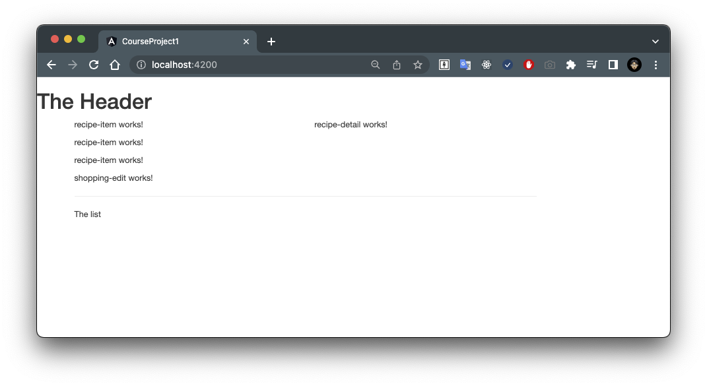

# 04. Using the Components

我們創建了所有這些 components ，現在讓我們開始使用它們。

## Using `app-recipies` and `app-shopping-list` in `app` component

我將在 `app` component 的 HTML 檔案中開始使用它們。

在 `app` component 中，我想顯示我的 `app-recipies` 與 `app-shopping-list` component ：

- [`app.component.html`](../../course-project-1/src/app/app.component.html)

```html
<app-header></app-header>
<div class="container">
  <div class="row">
    <div class="col-md-12">
      <app-recipes></app-recipes>
      <app-shopping-list></app-shopping-list>
    </div>
  </div>
</div>
```

## Using `app-recipe-list` and `app-recipe-detail` in `app-recipes` component

接下來讓我們來處理 `app-recipes-list` 與 `app-recipe-detail` component 。

根據之前的規劃，我們必須讓食譜列表和詳情並排。

所以為此，我將在 [`recipes.component.html`](../../course-project-1/src/app/recipes/recipes.component.html) 中添加：

- [`recipes.component.html`](../../course-project-1/src/app/recipes/recipes.component.html)

```html
<div class="row">
  <div class="col-md-5">
    <app-recipe-list></app-recipe-list>
  </div>
  <div class="col-md-7">
    <app-recipe-detail></app-recipe-detail>
  </div>
</div>
```

使用這些 bootstrap 的欄位大小類別來在右側擁有一個較寬的欄位。

在第一個欄位中，屬於 `app-recipe-list` component 

而在第二個欄位中，則屬於 `app-recipe-detail` component 。

## Using `app-recipe-item` in `app-recipe-list` component

在 `app-recipe-list` component 中，會輸出 `app-recipe-item` 清單。

- [`recipe-list.component.html`](../../course-project-1/src/app/recipes/recipe-list/recipe-list.component.html)

```html
<app-recipe-item></app-recipe-item>
<app-recipe-item></app-recipe-item>
<app-recipe-item></app-recipe-item>
```

## Using `app-shopping-edit` in `app-shopping-list` component

- [`shopping-list.component.html`](../../course-project-1/src/app/shopping-list/shopping-list.component.html)

```html
<div class="row">
  <div class="col-xs-10">
    <app-shopping-edit></app-shopping-edit>
    <hr>
    <p>The list</p>
  </div>
</div>
```

## Summary

大功告成，目前我們的應用程式的成果如下：


