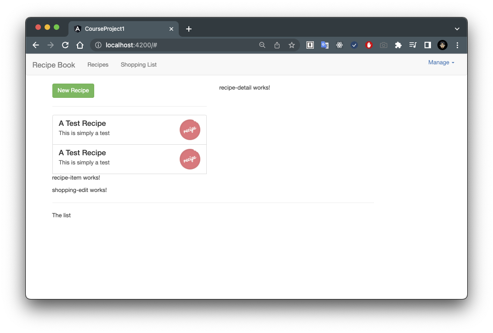

# 08. Outputting a List of Recipes with ngFor

現在顯然我們需要使用 NG for 來實現這一點，讓我們加上 NG for 。

這是一個指令，允許我們在模板中重複程式碼。

在這裡，我想要遍歷所有的食譜。

所以我實際上將創建一個名為 `recipe` 的本地變數。

這個名稱完全由你決定，它將在每次迭代中儲存我們循環中的每個食譜。

我將遍歷所有的食譜，也就是我們在 TypeScript document 中創建的這個 recipes 屬性。

- [`recipe-list-component.html`](../../course-project-1/src/app/recipes/recipe-list/recipe-list.component.html)

```html
<div class="row">
  <div class="col-xs-12">
    <a
      href="#"
      class="list-group-item clearfix"
      *ngFor="let recipe of recipes">
      ...
    </a>
  </div>
</div>
```

在這個 NG for 迴圈內的任何地方，都可以使用這個 `recipe` 變數。 所以讓我們使用它來輸出食譜資料。

我們可以使用字串插值來實現：

- [`recipe-list-component.html`](../../course-project-1/src/app/recipes/recipe-list/recipe-list.component.html)

```html
<div class="row">
  <div class="col-xs-12">
    <button class="btn btn-success">New Recipe</button>
  </div>
</div>
<hr>
<div class="row">
  <div class="col-xs-12">
    <a
      href="#"
      class="list-group-item clearfix"
      *ngFor="let recipe of recipes">
      <div class="pull-left">
        <h4 class="list-group-item-heading">{{ recipe.name }}</h4>
        <p class="list-group-item-text">{{ recipe.description }}</p>
      </div>
      <span class="pull-right">
        
      </span>
    </a>
    <app-recipe-item></app-recipe-item>
    </div>
</div>
```

關於這個來源，我們可以採取兩種方法。

你可以在這裡使用字串插值：

```html
<img
  src="{{ recipe.imagePath }}"
  ...
```

或者是屬性綁定：

```html
<img
  [src]="recipe.imagePath"
  ...
```

而不是字串插值。

這是一個很好的例子，你可以同時使用字串插值和常規的 HTML 屬性，或者不使用屬性，而是直接綁定圖片的 source 屬性，然後只需放入一個有效的表達式，返回這個屬性所期望的內容。

現在我將在這裡使用屬性綁定的方法！

讓我們保存並查看是否有所顯示。



當然，如果我點擊一筆食譜是沒有任何作用的，這是我們可以在未來添加的功能。

目前，食譜清單 component 正在形成中。

現在讓我們接著處理詳細資料操作。