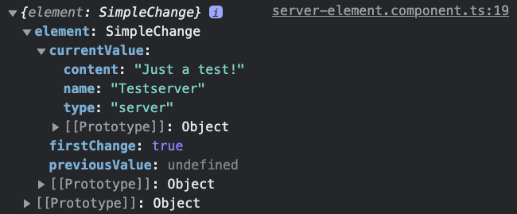
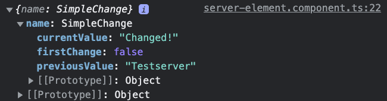

# 13. Seeing Lifecycle Hooks in Action

所以我們現在已經學到所有這些鉤子，讓我們看看它們實際上是做什麼的。

我選擇在這個 `server-element` 元件中示範。

## Constructor & `ngOnInit`

我們已經有了 constructor 和 `ngOnInit` 。

在 constructor 中，我會輸出 "constructor called!"，這樣我們就可以在 console 看到它在什麼時候被呼叫：

- [`server-element.component.ts`](../../cmp-databinding/src/app/server-element/server-element.component.ts)

```ts
...
export class ServerElementComponent implements OnInit {
  ...
  constructor() {
    console.log('constructor called!');
  }
  ...
}
```

而對於 `ngOnInit` ，我會做同樣的事情，輸出 "ngOnInit called!" ：

- [`server-element.component.ts`](../../cmp-databinding/src/app/server-element/server-element.component.ts)

```ts
...
export class ServerElementComponent implements OnInit {
  ...
  ngOnInit(): void {
    console.log('ngOnInit called!');
  }
  ...
}
```

當然，我也會添加其他鉤子，但讓我們先從這兩個開始。

如果重新載入應用程式，我們會看到 console 顯示了 "constructor called!" 和 "ngOnInit called!" ：

```
constructor called!                 server-element.component.ts:15
ngOnInit called!                    server-element.component.ts:19
```

而對於每個新添加的 server，我們都會再次看到這兩段輸出：

```
constructor called!                 server-element.component.ts:15
ngOnInit called!                    server-element.component.ts:19
constructor called!                 server-element.component.ts:15
ngOnInit called!                    server-element.component.ts:19
constructor called!                 server-element.component.ts:15
ngOnInit called!                    server-element.component.ts:19
...
```

當然這是因為創建了一個新的元件實例，因此所有這些鉤子都會再次執行，因為這是一個全新的實例，除了它是由第一個元件實例創建的這個類別之外，沒有其他共同點。

所以這就是 constructor 和 `ngOnInit` 。

## `ngOnChanges`

還記得上一小節提過 `ngOnChanges` 會創建開始時先執行。

雖然實作 `ngOnChanges` 就足夠了，但最好也實作 `OnChanges` 介面，對於所有鉤子都是如此：

- [`server-element.component.ts`](../../cmp-databinding/src/app/server-element/server-element.component.ts)

```ts
import { ..., OnChanges, ..., SimpleChanges, ... } from '@angular/core';
...
export class ServerElementComponent implements OnInit, OnChanges {
  ...
  ngOnChanges(changes: SimpleChanges): void {
    console.log('ngOnChanges called!');
    console.log(changes);
  }
  ...
}
```

> **Note**:
> 僅實作該方法就可以達到效果，但是實際上最好非常明確地指明你的元件使用哪些介面或擁有哪些方法，因此實作這些介面是一個非常好的實踐。 這樣很清楚地知道哪些方法可能會在你的元件中被呼叫，哪些方法不會被呼叫。

而 `ngOnChanges` 這個鉤子實際上會接收一個參數。 所以我們接收一個名為 `changes` 的參數，它的類型是 `SimpleChanges` ，這個類型也需要從 `@angular/core` 導入，所以我只是在這裡記錄一下 `changes` ，這樣我們可以查看一下它的內容。

> **Note**:
> `ngOnChanges` 是唯一一個帶參數的鉤子。

讓我們保存這個並重新載入，觀察 console 的輸出：

```
constructor called!                 server-element.component.ts:15
ngOnChanges called!                 server-element.component.ts:18
{element: SimpleChange}             server-element.component.ts:19
ngOnInit called!                    server-element.component.ts:23
```

其中 `{element: SimpleChange}` 是一個物件，裡面有一個名為 `element` 的屬性，它是一個 `SimpleChange` 類型的值，而這個 `element` 當然就是我們的綁定屬性：

- [`server-element.component.ts`](../../cmp-databinding/src/app/server-element/server-element.component.ts)

```ts
...
export class ServerElementComponent implements OnInit, OnChanges {
  ...
  @Input('srvElement')
  element: { type: string, name: string, content: string };
  ...
}
```

在這裡，它是這個 `element` 屬性的名稱，然後 Angular 簡單地提供一些資訊，現在的值是什麼；當然，這是一個只有一個 `test` 、 `Testserver` 、以及類型為 `server` 的物件；這是第一次更改嗎（`firstChange`）？ `true` 是的，我們剛初始化它；還有先前的值，這裡沒有值，因為在此之前我們沒有更改它：



為了測試 `ngOnChanges` 實際上被呼叫多次，我會在 [`app.component.html`](../../cmp-databinding/src/app/app.component.html) 中添加一個  ` Change first element ` 按鈕，並給它一個 `click` 監聽器，命名為 `onChangeFirst()` ：

- [`app.component.html`](../../cmp-databinding/src/app/app.component.html)

```html
<div class="container">
      ...
      <button
        class="btn btn-primary"
        (click)="onChangeFirst()">Change first element</button>
        ...
```

然後，在 `app` 元件的 TypeScript 檔案中，創建該 `onChangeFirst()` 方法：

- [`app.component.ts`](../../cmp-databinding/src/app/app.component.ts)

```ts
```

現在，為此，我還需要更改我們將這個元素傳遞給 `server` 元件的方式。

之前，我們是接收整個完整的 `element` ，完整的物件，我會保留這個程式碼，供你參考，但現在我只希望獲得名稱，因為名稱是我在這裡輸出的唯一內容：

- [`server-element.component.ts`](../../cmp-databinding/src/app/server-element/server-element.component.ts)

```ts
...
export class ServerElementComponent implements OnInit, OnChanges {

  @Input('srvElement')
  element: { type: string, name: string, content: string };

  @Input()
  name: string;
  ...
}
```

所以我將舊的程式碼註釋掉，現在我們只輸出名稱（`name`），因為所有其他元素的資訊已經透過 `ng-content` 投影到這個元件中：

- [`server-element.component.html`](../../cmp-databinding/src/app/server-element/server-element.component.html)

```html
  ...
  <!-- <div class="panel-heading">{{ element.name }}</div> -->
  <div class="panel-heading">{{ name }}</div>
  ...
```

所以現在我們只獲得名稱，這個名稱只是一個字串。

我們添加了 `@Input` 標記，這樣它可以從外部綁定，我們在 [`server-element.component.html`](../../cmp-databinding/src/app/server-element/server-element.component.html) 的 `{{ name }}` 輸出名稱。

在 app 元件中，當我們遍歷時，我現在將每個伺服器 model 的名稱實際上綁定到 `server-element` 的名稱（在這裡其實不再需要在這裡綁定 `serverElement` ，但我將保留它作為參考）：

- [`app.component.html`](../../cmp-databinding/src/app/app.component.html)

```html
...
      <app-server-element
        *ngFor="let serverElement of serverElements"
        [srvElement]="serverElement"
        [name]="serverElement.name">
...
```

現在我們傳遞資料的方式就是這樣。

在 `app` 元件的 typescript 中，在 `onChangeFirst` 方法中，我現在要訪問我的 `serverElements` 的第一個元素，因此如果你將此陣列清空並將名稱設置為 `Changed!` ，這將失敗：

- [`app.component.ts`](../../cmp-databinding/src/app/app.component.ts)

```ts
...
export class AppComponent {
  ...
  onChangeFirst() {
    this.serverElements[0].name = 'Changed!';
  }
}
```

所以，我進行了這些更改，以便我們可以真正看到當 `ngOnChanges` 被觸發時的情況，我們不能使用物件作為物件是引用類型，所以我們通過輸入傳遞了這個物件，因此 server 元件中的這個屬性和 `app` 元件中 `serverElements` 陣列中的物件都指向內存中的同一個位置，因此，如果我們更改那裡的名稱，它將更新到子元件 `server` 元件中，但它不會觸發 `ngOnChanges` ，因為從技術上講，我們在這裡使用的是這個輸入綁定的屬性。

這沒有變，它的值沒有變，它仍然是同一個物件內存中的值。

所以這只是 reference 和 primitive types 之間的區別。 這是 JavaScript 的概念，與 Type Script 或 Angular 無關。

這就是為什麼現在我綁定到一個 primitive types 的 `name` 名稱，它只是一個字串，因此如果我點擊 ` Change first element ` 按鈕， `ngOnChanges` 應該再次被觸發：

```
ngOnChanges called!                 server-element.component.ts:21
{ name: SimpleChange }              server-element.component.ts:22
```

確實如此。

但請注意 constructor 和 `ngOnInit` 沒有被調用，而 `ngOnChanges` 被調用了，現在我們還有先前的值和新的值：



因此，如果你想對任何更改作出反應並對舊值進行一些操作，這個鉤子對你來說可能更有趣。

## `ngDoCheck`

接著是 `ngDoCheck` ，我們只是簡單輸出 "ngDoCheck called!" ：

- [`server-element.component.ts`](../../cmp-databinding/src/app/server-element/server-element.component.ts)

```ts
import { ..., DoCheck, ... } from '@angular/core';
...
export class ServerElementComponent implements OnInit, OnChanges, DoCheck {
  ...
  ngDoCheck(): void {
    console.log('ngDoCheck called!');
  }
}
```

這個鉤子在每個變更檢測運行之後都會被呼叫，這意味著在每個 Angular 變更檢測周期中都會呼叫它。

這是一個非常有用的鉤子，當你需要在 Angular 檢測期間進行自己的變更檢測時。

你可以在這個鉤子中寫入自定義邏輯，並檢查你希望檢測的任何變更。

但要注意，由於它在每個變更檢測週期中都被呼叫，所以要小心使用，因為如果你在這裡執行昂貴的操作，可能會導致性能問題。

## `ngAfterContentInit`

還有一個 `ngAfterContentInit` 鉤子：

- [`server-element.component.ts`](../../cmp-databinding/src/app/server-element/server-element.component.ts)

```ts
import { AfterContentInit, ... } from '@angular/core';
...
export class ServerElementComponent implements OnInit, OnChanges, DoCheck, AfterContentInit {
  ...
  ngAfterContentInit(): void {
    console.log('ngAfterContentInit called!');
  }
}
```

這個鉤子在 Angular 將投影內容初始化之後被呼叫。

在我們的 server 元件中，我們將投影進來的內容，這裡我們使用的是 ng-content，將它放在了模板的頂部。

這個 `ngAfterContentInit` 鉤子在投影內容初始化之後被呼叫，這意味著當我們將內容投影到這個元件中時， `ngAfterContentInit` 將被呼叫。

## `ngAfterContentChecked`

接著是 `ngAfterContentChecked` ：

- [`server-element.component.ts`](../../cmp-databinding/src/app/server-element/server-element.component.ts)

```ts
import { ..., AfterContentChecked, ... } from '@angular/core';
...
export class ServerElementComponent implements OnInit, OnChanges, DoCheck, AfterContentInit, AfterContentChecked {
  ...
  ngAfterContentChecked(): void {
    console.log('ngAfterContentChecked called!');
  }
}
```

這個鉤子在每次 Angular 檢查投影內容之後都會被呼叫。

就像 `ngDoCheck` 一樣，你需要小心使用這個鉤子，因為它在每次檢測之後都會被呼叫，如果你在這裡進行昂貴的操作，可能會導致性能問題。

## `ngAfterViewInit` & `ngAfterViewChecked`

- [`server-element.component.ts`](../../cmp-databinding/src/app/server-element/server-element.component.ts)

```ts
import { ..., AfterViewInit, AfterViewChecked, ... } from '@angular/core';
...
export class ServerElementComponent implements OnInit, OnChanges, DoCheck, AfterContentInit, AfterContentChecked, AfterViewInit, AfterViewChecked {
  ...
  ngAfterViewInit(): void {
    console.log('ngAfterViewInit called!');
  }

  ngAfterViewChecked(): void {
    console.log('ngAfterViewChecked called!');
  }
}
```

## `ngOnDestroy` 

剩下的是 ngOnDestroy ，就在它被銷毀之前被呼叫。

- [`server-element.component.ts`](../../cmp-databinding/src/app/server-element/server-element.component.ts)

```ts
import { ..., OnDestroy, ... } from '@angular/core';
...
export class ServerElementComponent implements OnInit, OnChanges, DoCheck, AfterContentInit, AfterContentChecked, AfterViewInit, AfterViewChecked, OnDestroy {
  ...
  ngOnDestroy(): void {
    console.log('ngOnDestroy called!');
  }
}
```

為了真正看到它被銷毀，我將添加一個刪除的按鈕：

- [`app.component.html`](../../cmp-databinding/src/app/app.component.html)

```html
...
      <button
        class="btn btn-primary"
        (click)="onChangeFirst()">Change first element</button>
      <button
        class="btn btn-danger"
        (click)="onDestroyFirst()">Destroy</button>
...
```

- [`app.component.ts`](../../cmp-databinding/src/app/app.component.ts)

```ts
...
export class AppComponent {
  ...
  onDestroyFirst() {
    this.serverElements.splice(0, 1);
  }
}
```

其中 `onDestroyFirst` 只是調用 `serverElements` 陣列的 `splice` 方法，從第一個元素開始刪除一個元素，因此將其刪除。

如果我銷毀這個元件，你會看到 `ngOnDestroy` 被呼叫，因為我們從陣列中刪除了它，因此 `ngFor` 重新運行並且不渲染這個第一個元素，因為它被刪除了，因此這個元件的鉤子被呼叫：

```
ngOnDestroy called!                 server-element.component.ts:51
```

## Summary

這些就是所有的生命週期鉤子在工作中的情況。

你很少需要使用全部，但其中一些對於你的應用程式來說可能非常有用，可以鉤入到特定的部分、特定的階段並運行你的程式碼。