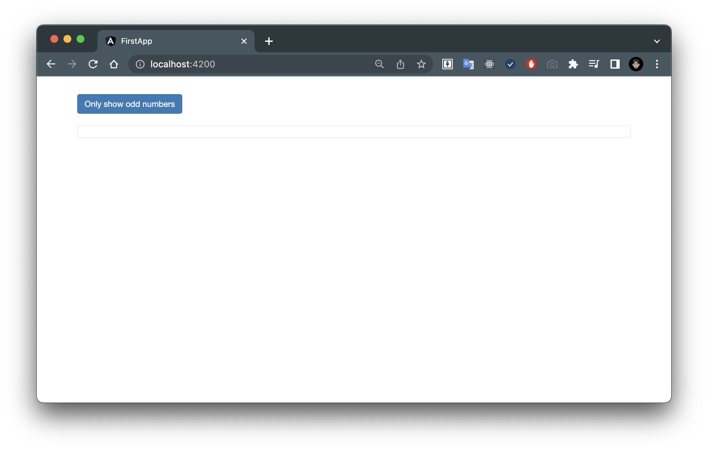
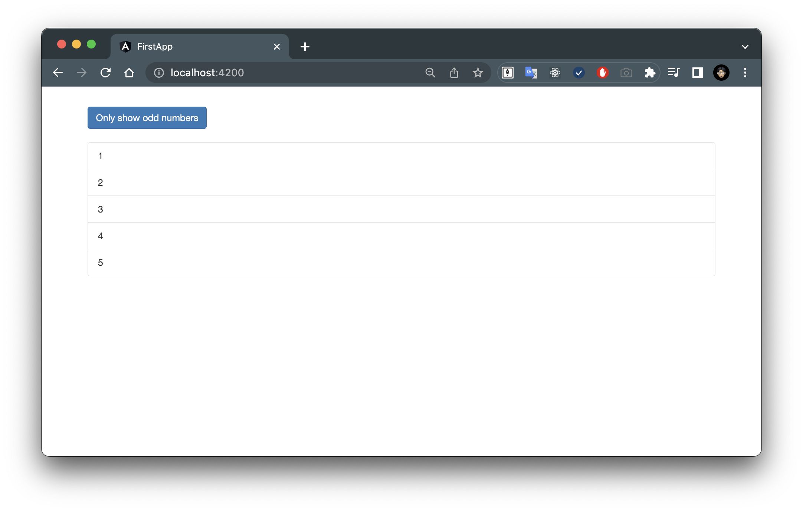

# `ngFor` and `ngIf` Recap

我已經準備了一個 `directives` 專案。 



這個專案非常簡單，有一個 ` Only show odd numbers ` 按鈕，可以切換只顯示奇數，但目前我們看不到任何數字，因為雖然我在 `app` component 的 TypeScript 檔案中有一個數字陣列，但我沒有在 [`app.component.hyml`](../../directives/src/app/app.component.html) 模板中輸出它。

不過，我已經建立了一個 `<li>` 清單：

- [`app.component.html`](../../directives/src/app/app.component.html)

```html
      ...
      <ul class="list-group">
        <li
          class="list-group-item">
        </li>
      </ul>
      ...
```

## Using `ngFor` Directive

因此，讓我們簡單地在這個清單專案中添加 `ngFor` 指令並帶有星號（`*`），因為它是一個結構指令。 然後，我們可以簡單地使用 `let number of numbers` 這樣的語法。
：

- [`app.component.html`](../../directives/src/app/app.component.html)

```html
      ...
      <ul class="list-group">
        <li
          class="list-group-item"
          *ngFor="let number of numbers">
        </li>
      </ul>
      ...
``` 

我們已經學過這個語法，如果需要的話，我們甚至還可以提取索引，但在這裡我們不需要：

- [`app.component.html`](../../directives/src/app/app.component.html)

```html
      ...
      <ul class="list-group">
        <li
          class="list-group-item"
          *ngFor="let number of numbers; let i = index">
        </li>
      </ul>
      ...
```

這就是我們的單個數字，這樣它現在就可以在這裡輸出了：

- [`app.component.html`](../../directives/src/app/app.component.html)

```html
      ...
      <ul class="list-group">
        <li
          class="list-group-item"
          *ngFor="let number of numbers">
          {{ number }}
        </li>
      </ul>
      ...
``` 

我們可以在我們放置了 `ngFor` 的元素內的任何位置輸出它，包括任何嵌套的元素。

通過這樣，我們輸出了數字，現在我們看到了 1 、 2 、 3 、 4 、 5 ：



但按鈕仍然沒有起作用。

原因是，雖然我們現在點擊按鈕時有動作，我們將 [`app.component.ts`](../../directives/src/app/app.component.ts) 中的 `onlyOdd` 這個屬性設置為與當前相反的值。

如果它是 `false` ，我們將它設置為 `true` ，反之亦然，但我們沒有使用這個信息！

所以讓我們使用它。

## Using `ngIf` Directive

現在，我們可以嘗試在已經使用了 `ngFor` 的同一個元素上替換 `ngIf` ，並檢查 `number % 2` 這是否等於 `0` ，這將意味著我們只顯示偶數元素，對嗎？

- [`app.component.html`](../../directives/src/app/app.component.html)

```html
      ...
      <ul class="list-group">
        <li
          class="list-group-item"
          *ngFor="let number of numbers"
          *ngIf="number % 2 === 0">
          {{ number }}
        </li>
      </ul>
      ...
```

如果這樣做，我們會出現一個編譯錯誤，因為在同一個元素上不能有多個結構指令：

```
ERROR
src/app/app.component.html:12:11 - error NG5002: 
Can't have multiple template bindings on one element. Use only one attribute prefixed with *
```

它只是不起作用。

但我們不需要這樣。

我們只需對主要的 `app` 進行一個小變動，拆分奇數陣列與偶數陣列：

- [`app.component.ts`](../../directives/src/app/app.component.ts)

```ts
...
export class AppComponent {
  // numbers = [1, 2, 3, 4, 5];
  oddNumbers = [1, 3, 5];
  evenNumbers = [2, 4];
  ...
}
```

> **Note**:
> 這只是一個指令的演示應用程式，所以這可能不是你真正需要的應用程式的最佳解決方案。 在管道 (pipe) 課程中，你將學習如何動態篩選陣列。

有了這個，我們就可以在 [`app.component.html`](../../directives/src/app/app.component.html) 中遍歷所有的奇數與偶數陣列。

接著，為了只顯示其中一個，我們只需將它們放在一個 `<div>` 元素中。

所以讓我們將 `<li>` 放在 `<div>` 中，然後在 `<div>` 上加上 `ngIf`，奇數只在 `onlyOdd` 為 `true` 時顯示。 對於偶數我們也在這上面放上 `ngIf`，在這裡檢查是否 `!onlyOdd` ：

- [`app.component.html`](../../directives/src/app/app.component.html)

```html
      ...
      <div *ngIf="onlyOdd">
        <li
          class="list-group-item"
          *ngFor="let odd of oddNumbers">
          {{ odd }}
        </li>
      </div>
      <div *ngIf="!onlyOdd">
        <li
          class="list-group-item"
          *ngFor="let even of evenNumbers">
          {{ even }}
        </li>
      </div>
      ...
```

現在我們看到我們可以在這兩個清單之間切換。

## Summary

以上就是 `ngFor` 和 `ngIf` 的使用方式。

這是我們目前學到的其中 2 個結構指令以及如何使用它們的方式。

記住它們不能在同一個元素上同時使用！