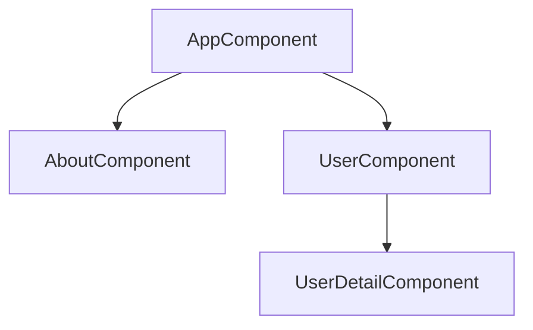
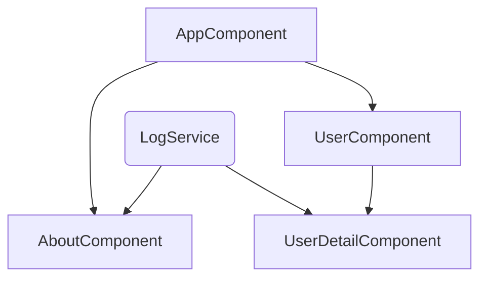
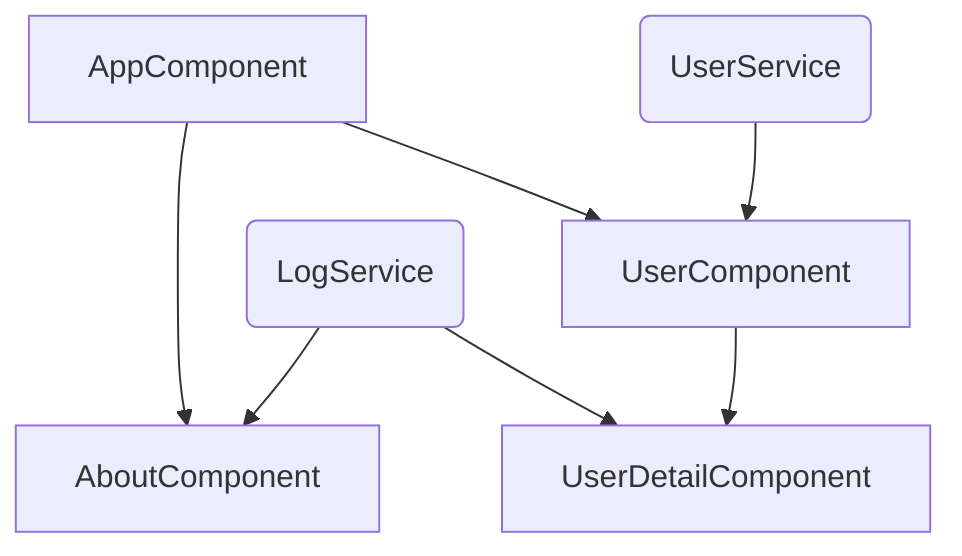

# 01. Introduction to Services

這個章節是關於服務（services）和依賴注入（dependence injection）。

那麼，什麼是服務呢？

## What are Services

什麼是服務？ 讓我們思考以下這個應用程式。

我們有一個 `app` 元件、 `about` 元件、 `user` 元件和 `user-detail` 元件。

現在，這些元件中可能會有一些方法：

- `AboutComponent`: log data to console.
- `UserDetailComponent`: log data to console.
- `UserComponent`: store user data.

假設我們想要將一些資料記錄到控制台中，如 `about` 元件和 `user-detail` 元件，而且這個記錄敘述可能非常相似，基本上是相同的文字。

因此，我們在這裡基本上在重複相同的工作。

我們在兩個不同的元件中重複了程式碼。

而在 `user` 元件中。

我們也希望存取一些資料，例如一個使用者的陣列，也許我們也不知道日後是否會在應用程式的其他部分中使用它。

程式碼的重複和資料儲存提供是服務的典型使用案例。

因為服務基本上只是 Angular 應用程式中的另一個元件，另一個你可以添加的類別，它作為一個中央儲存庫。

可以說是一個中央的業務單位，在其中可以儲存、集中你的程式碼。

因此，我們可以創建一個記錄服務（`LogService`），例如將我們的記錄敘述集中起來：

我們也可以創建一個使用者服務（`UserService`）來管理這裡的資料儲存：

讓我們在一個真實的應用程式中看一下，這樣會更清楚一些。