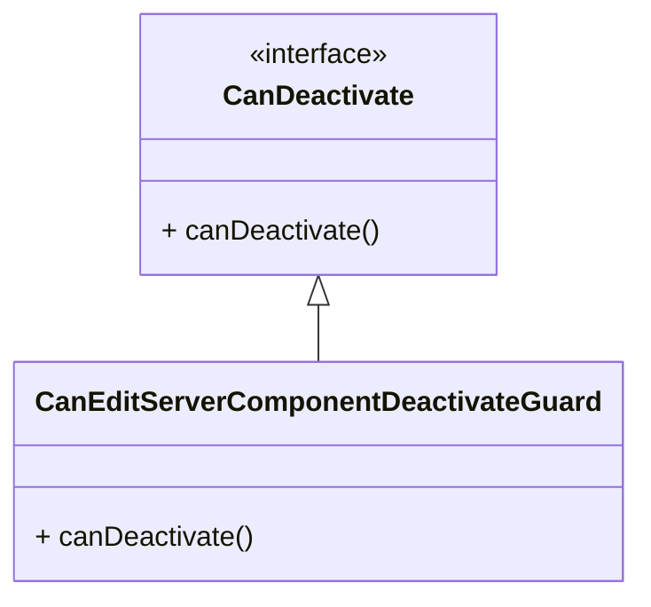

# 26. Controlling Navigation with `canDeactivate` (Basic)

現在我們希望實作一個功能，當使用者在編輯頁面時，如果**尚未儲存**，按下瀏覽器的返回按鈕時會跳出一個對話框，詢問使用者是否確定要離開這個頁面。

而 Angular 路由器提供了一個內建功能，稱為 `canDeactivate` ，允許我們在離開元件之前運行程式碼。 這個功能使我們能夠以更簡潔高效的方式實現必要的檢查。

## 1. Create `CanEditServerComponentDeactivateGuard` Service

首先我們先創建一個「檢查是否可以離開編輯伺服器頁面」的守衛服務：

```shell
cd src/app/servers/edit-server
touch can-edit-server-component-deactivate-guard.service.ts
```

- [`can-edit-server-component-deactivate-guard.service.ts`](../../routing-app/src/app/servers/edit-server/can-edit-server-component-deactivate-guard.service.ts)

```ts
export class CanEditServerComponentDeactivateGuard {

}
```

至於該守衛服務的實作方式如下：

### 1.1 Implementing the `CanDeactivate` Interface

首先我們讓該守衛服務實作 `CanDeactivate<T>` 介面：



- [`can-edit-server-component-deactivate-guard.service.ts`](../../routing-app/src/app/servers/edit-server/can-edit-server-component-deactivate-guard.service.ts)

```ts
import { CanDeactivate } from '@angular/router';

export class CanEditServerComponentDeactivateGuard implements CanDeactivate {

}
```

而我們會發現 `CanDeactivate<T>` 介面需要一個型別參數 `T` ，這個型別參數代表的是「要保護的元件類型」，所以我們當然可以直接將 `T` 指定為 `EditServerComponent` ：

- [`can-edit-server-component-deactivate-guard.service.ts`](../../routing-app/src/app/servers/edit-server/can-edit-server-component-deactivate-guard.service.ts)

```ts
import { CanDeactivate } from '@angular/router';
import { EditServerComponent } from './edit-server/edit-server.component';

export class CanEditServerComponentDeactivateGuard implements CanDeactivate<EditServerComponent> {

}
```

### 1.2 Implementing the `canDeactivate()` Method

接著我們實作 `canDeactivate()` 方法，該方法將返回一個 `Observable`、`Promise` 或 `boolean` 。

該方法的實作邏輯則是：如果使用者已經儲存了變更，則返回 `true` ，否則返回 `false` ：

- [`can-edit-server-component-deactivate-guard.service.ts`](../../routing-app/src/app/servers/edit-server/can-edit-server-component-deactivate-guard.service.ts)

```ts
import { ActivatedRouteSnapshot, CanDeactivate, RouterStateSnapshot, UrlTree } from '@angular/router';
import { EditServerComponent } from './edit-server.component';
import { Observable } from 'rxjs';

export class CanEditServerComponentDeactivateGuard implements CanDeactivate<EditServerComponent> {
  
  canDeactivate(component: EditServerComponent, currentRoute: ActivatedRouteSnapshot, currentState: RouterStateSnapshot, nextState?: RouterStateSnapshot): boolean | Observable<boolean> | Promise<boolean> {
    if (!component.allowEdit) {
      return true;
    }
    if ((component.serverName !== component.server.name || component.serverStatus !== component.server.status) || !component.changeSaved) {
      return confirm('Do you want to discard the changes?');
    }
  }
}
```

## 2. Register `CanEditServerComponentDeactivateGuard` Service

接著我們將 `CanEditServerComponentDeactivateGuard` 服務註冊到 `app.module.ts` 中：

- [`app.module.ts`](../../routing-app/src/app/app.module.ts)

```diff
...
+ import { CanEditServerComponentDeactivateGuard } from './servers/edit-server/can-edit-server-component-deactivate-guard.service';

@NgModule({
  ...
+ providers: [ServersService, AuthService, AuthGuard, CanEditServerComponentDeactivateGuard],
- providers: [ServersService, AuthService, AuthGuard],
  ...
})
export class AppModule { }
```

## 3. Add `canDeactivate` Property to `EditServerComponent` Class

最後我們在 Routing 設定檔 [`app-routing.module.ts`](../../routing-app/src/app/app-routing.module.ts) 中，為 `EditServerComponent` 元件中新增一個 `canDeactivate` 屬性，並且將其設定為 `CanEditServerComponentDeactivateGuard` 服務：

- [`app-routing.module.ts`](../../routing-app/src/app/app-routing.module.ts)

```diff
...
+ import { CanEditServerComponentDeactivateGuard } from './servers/edit-server/can-edit-server-component-deactivate-guard.service';

const appRoutes: Routes = [
  ...
  { path: 'servers', canActivateChild: [AuthGuard], component: ServersComponent, children: [
    { path: ':id', component: ServerComponent }, // localhost:4200/servers/:id
+   { path: ':id/edit', component: EditServerComponent, canDeactivate: [CanEditServerComponentDeactivateGuard] },
-   { path: ':id/edit', component: EditServerComponent },
  ] },
  ...
];

...
export class AppRoutingModule { }
```