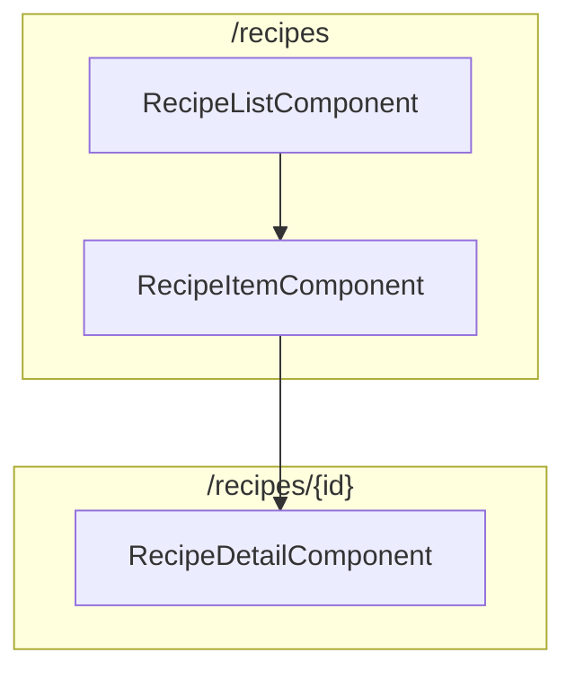
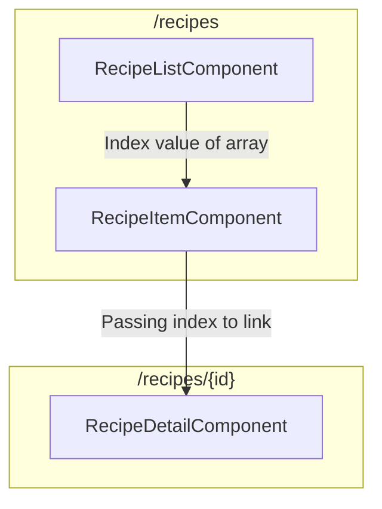

# 07. Passing Dynamic Parameters to Links

回顧 [`Ch10 - 04. Navigating with Router Links`](../ch10-changing-pages-with-routing/04-navigating-with-router-links.md)，我們學習到了實作 links 的 Best Practice，這裡我們就使用 `routerLink` 來實作 Recipe 清單的 links。

## Notes

在實作之前我們需要先釐清一些事項：

1. Recipe 清單的 links 是在 `RecipeItemComponent` 中實作的，所以我們需要在 `RecipeItemComponent` 中使用 `routerLink`。
2. `Recipe` model 沒有 `id` 屬性，所以我們使用 `recipes` 陣列的索引值 `index` 來代替。
3. `RecipeListComponent`、`RecipeItemComponent`、`RecipeDetailComponent` 三者的關係如下：



實作的思路如下：



## 1. Adding an `index` Property in `RecipeItemComponent`

- [`recipe-item.component.ts`](../../course-project-1/src/app/recipes/recipe-list/recipe-item/recipe-item.component.ts)

```diff
...
@Component({
  selector: 'app-recipe-item',
  templateUrl: './recipe-item.component.html',
  styleUrls: ['./recipe-item.component.css']
})
export class RecipeItemComponent {

  @Input()
  recipe: Recipe;

+ @Input()
+ index: number;
}
```

## 2. Passing the Array's Index value to `RecipeItemComponent`

- [`recipe-list.component.html`](../../course-project-1/src/app/recipes/recipe-list/recipe-list.component.html)

```diff
...
<div class="row">
  <div class="col-xs-12">
    <app-recipe-item
-     *ngFor="let recipeElement of recipes"
+     *ngFor="let recipeElement of recipes; let i = index"
+     [index]="i"
      [recipe]="recipeElement"></app-recipe-item>
    </div>
</div>
```

## 3. Passing Dynamic Parameters to Links

我們透過「屬性綁定」來使用 `routerLink` ，值得思考的是我們該傳入什麼陣列元素？

根據前兩小節的實作，我們知道 `RecipeDetailComponent` 的路由是 `/recipes/:id` ，所以我們需要傳入的就是一個陣列元素，第一個元素是 `/recipes`，第二個元素是 `id` 值。

### 3.1 Option 1: Using Absolute Path

- [`recipe-item.component.html`](../../course-project-1/src/app/recipes/recipe-list/recipe-item/recipe-item.component.html)

```diff
<a
  style="cursor: pointer;"
+ [routerLink]="['recipes', index]"
  class="list-group-item clearfix"
  >
  ...
</a>
```

> **Warning**:
> 我們這裡的 `Recipe` model 沒有 `id` 屬性，所以我們使用 `recipes` 陣列的索引值 `index` 來代替。

### 3.2 Option 2: Using Relative Path

然而 `RecipeItemComponent` 的路由已經是 `recipes` 了，所以我們也可以使用「相對路徑」： 

- [`recipe-item.component.html`](../../course-project-1/src/app/recipes/recipe-list/recipe-item/recipe-item.component.html)

```diff
<a
  style="cursor: pointer;"
+ [routerLink]="[index]"
  class="list-group-item clearfix"
  >
  ...
</a>
```

> **Warning**:
> 我們這裡的 `Recipe` model 沒有 `id` 屬性，所以我們使用 `recipes` 陣列的索引值 `index` 來代替。

