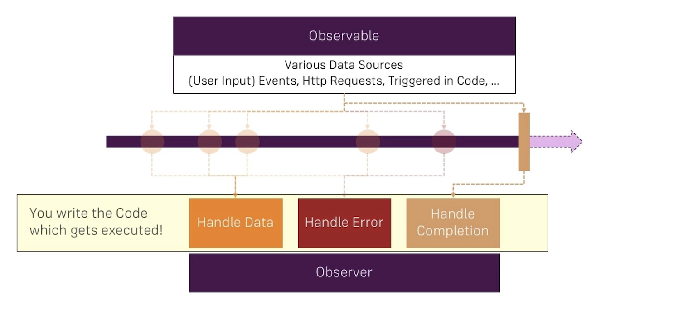

# 01. Module Introduction

## What is an Observable

可觀察物件是 Angular 的基礎組成部分，可以視為數據來源。 在我們的 Angular 專案中，可觀察物件是從一個名為 [RxJS](https://rxjs.dev/) 的第三方套件中匯入的物件。 這些可觀察物件遵循可觀察物件模式，其中包含一個「可觀察物件」作為數據來源、一個「觀察者」來處理發出的數據，以及將它們連接在一起的流（Stream）或時間軸。 

在可觀察物件內部，根據數據來源，我們可以發出多個事件或數據封包。 這些數據封包可以通過程式觸發，與 UI 事件（例如按鈕點擊）相關聯，或者與 HTTP 請求相關聯。 可觀察物件提供了在 Angular 應用程式中處理異步任務的靈活且強大的方式。 

## The Observer

觀察者代表著你的程式碼，負責訂閱可觀察物件。 它涉及使用 `subscribe()` 方法或其它類似的方法。 在觀察者中，你可以使用 3 種方式來處理接收到的數據封包：

1. 普通數據
2. 錯誤
3. 可觀察物件的完成

這些鉤子提供了根據接收到的數據封包類型執行特定程式碼的機會。 

需要注意的是，可觀察物件不一定需要完成。 例如，與 UI 事件（如按鈕點擊）相關聯的可觀察物件可能沒有明確的結束。 另一方面，與 HTTP 請求相關聯的可觀察物件將在接收到響應後最終完成。 

## Advantages of Observables

在 Angular 中，可觀察物件特別適用於管理異步任務。 它們相對於傳統的 Callback function 或 Promises 等方法具有明顯的優勢。 Angular 廣泛使用可觀察物件，原因在於它們具有強大的運算子，可實現複雜的數據操作和轉換。 