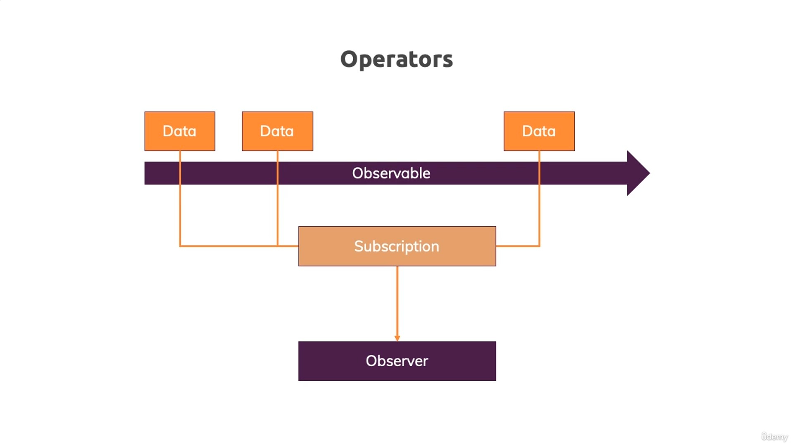
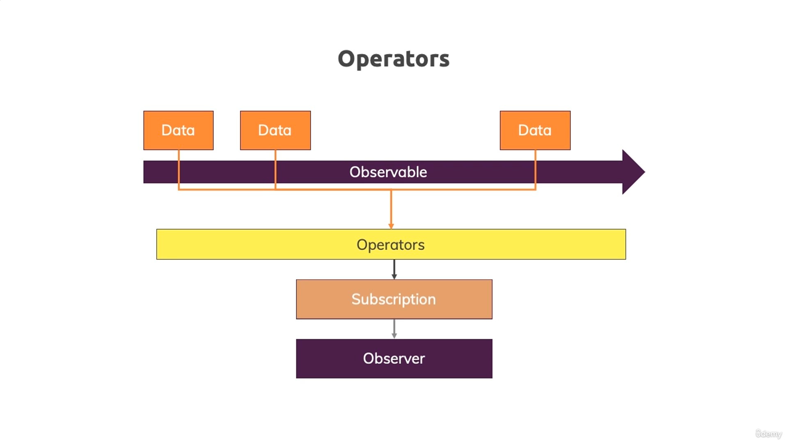

# 08. Understanding Operators

## Introduction





## Example

例如我們在之前的範例中，可能不想只單純輸出 0、1、...、N，而是輸出較人性化的 Round 1、Round 2、...、Round N+1。 我們當然可以直接在 `subscribe()` 中加入一些程式碼邏輯來加工：

- [`home.component.ts`](../../obs-app/src/app/home/home.component.ts)

```diff
    ...
    this.firstObsSubscription = customIntervalObservable.subscribe(data => {
-     console.log(data);
+     console.log('Round: ' + (data + 1));
    }, error => {
      console.log(error);
      alert(error.message);
    }, () => {
      console.log('Completed!');
    });
    ...
```

### `map()` Operator

但 Observable 本身其實也提供了一些方法來幫助我們達成這樣的需求，這些方法就是所謂的 operators，它提供我們在「`subscribe()` 之前」能夠對 data 進行操作，使程式碼更加清晰。 像是以上的需求，我們就可以使用 `map()` operator 來達成：

- [`home.component.ts`](../../obs-app/src/app/home/home.component.ts)

```diff
...
+ import { map } from 'rxjs/operators';

...
export class HomeComponent implements OnInit, OnDestroy {
    ...
-   this.firstObsSubscription = customIntervalObservable.subscribe(data => {
+   this.firstObsSubscription = customIntervalObservable.pipe(map((data: number) => {
+     return 'Round: ' + (data + 1);
+   })).subscribe(data => {
      console.log(data);
    }, error => {
      console.log(error);
      alert(error.message);
    }, () => {
      console.log('Completed!');
    });
    ...
}
```

### `filter()` Operator

還有 `filter()` operator，可以讓我們在 `subscribe()` 之前先對 data 進行過濾：

- [`home.component.ts`](../../obs-app/src/app/home/home.component.ts)

```diff
...
- import { map } from 'rxjs/operators';
+ import { filter, map } from 'rxjs/operators';

...
export class HomeComponent implements OnInit, OnDestroy {
    ...
-   this.firstObsSubscription = customIntervalObservable.pipe(map((data: number) => {
+   this.firstObsSubscription = customIntervalObservable.pipe(filter((data: number) => {
+     return data > 0;
+   }), map((data: number) => {
      return 'Round: ' + (data + 1);
    })).subscribe(data => {
      console.log(data);
    }, error => {
      console.log(error);
      alert(error.message);
    }, () => {
      console.log('Completed!');
    });
    ...
}
```

## Conclusion

可以發現這基本上就跟 Java 8 的 Stream API 相似，有 `map()`、`filter()` 等等的 operators，這些 operators 都是 RxJS 提供的，我們可以透過 `pipe()` 來串接多個 operators，最後再透過 `subscribe()` 來訂閱這些「加工後的 data」。