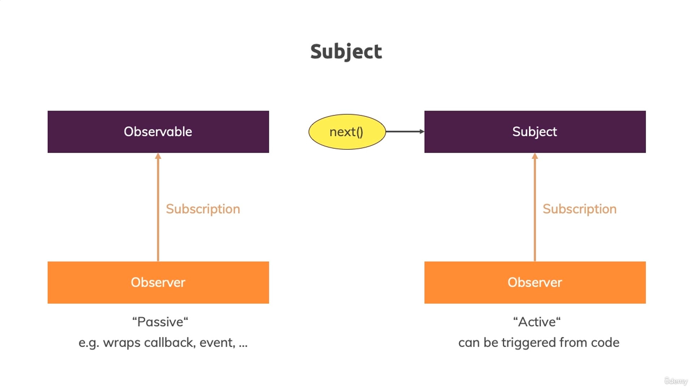

# 09. Subjects

假設今天我們有一個需求，當使用者按下 `Activate` 按鈕時，我們要在 `AppComponent` 中顯示 `Activated!` 的文字。

## (Old approach) Using Event Emitters

在過去，我們會使用 `EventEmitter` 來達成這個需求。

### Adding `Activated!` paragraph and using `ngIf` directive

- [`app.component.html`](../../obs-app/src/app/app.component.html)

```diff
<div class="container">
  ...
  <hr />
+ <p *ngIf="userActivated">Activated!</p>
  <div class="row">
    <div class="col-xs-12 col-sm-10 col-md-8 col-sm-offset-1 col-md-offset-2">
      <router-outlet></router-outlet>
    </div>
  </div>
</div>
```

### Adding button and listennig to click event

- [`user.component.html`](../../obs-app/src/app/user/user.component.html)

```diff
<p>User with <strong>ID {{ id }}</strong> was loaded</p>
+ <button class="btn btn-primary" (click)="onActivate()">Activate</button>
```

### Adding User Service

- [`user.service.ts`](../../obs-app/src/app/user.service.ts)

```ts
import { EventEmitter, Injectable } from '@angular/core';

@Injectable({providedIn: 'root'})
export class UserService {
  activatedEmitter = new EventEmitter<boolean>();
}
```

### Declaring `onActivate()` method and emitting `true` value by Injected `UserService`

- [`user.component.ts`](../../obs-app/src/app/user/user.component.ts)

```diff
...
+ import { UserService } from '../user.service';

@Component({
  selector: 'app-user',
  templateUrl: './user.component.html',
  styleUrls: ['./user.component.css']
})
export class UserComponent implements OnInit {
  id: number;

  constructor(private route: ActivatedRoute,
+             private userService: UserService) {
  }

  ngOnInit() {
    this.route.params.subscribe((params: Params) => {
      this.id = +params.id;
    });
  }

+ onActivate() {
+   this.userService.activatedEmitter.emit(true);
+ }
}
```

### Subscribing to `activatedEmitter` and setting `userActivated` property to `true`

- [`app.component.ts`](../../obs-app/src/app/app.component.ts)

```diff
...
+ import { UserService } from './user.service';

@Component({
  selector: 'app-root',
  templateUrl: './app.component.html',
  styleUrls: ['./app.component.css']
})
export class AppComponent implements OnInit {

+ userActivated = false;

- constructor() {}
+ constructor(private userService: UserService) {}

  ngOnInit() {
+   this.userService.activatedEmitter.subscribe(didActivate => {
+     this.userActivated = didActivate;
+   });
  }
}
```

## (New approach) Using Subjects



現在我們將使用 `Subject` 來取代 `EventEmitter` ：

- [`user.service.ts`](../../obs-app/src/app/user.service.ts)

```diff
- import { EventEmitter, Injectable } from '@angular/core';
+ import { Injectable } from '@angular/core';
+ import { Subject } from 'rxjs';

@Injectable({providedIn: 'root'})
export class UserService {
- activatedEmitter = new EventEmitter<boolean>();
+ activatedSubject = new Subject<boolean>();
}
```

而 `Subject` 其實也是 `Observable` 的一種，所以我們可以使用 `next()` 方法來發送值：

- [`user.component.ts`](../../obs-app/src/app/user/user.component.ts)

```diff
...
export class UserComponent implements OnInit {
  id: number;

  constructor(private route: ActivatedRoute,
              private userService: UserService) {
  }

  ngOnInit() {
    this.route.params.subscribe((params: Params) => {
      this.id = +params.id;
    });
  }

  onActivate() {
-   this.userService.activatedEmitter.emit(true);
+   this.userService.activatedSubject.next(true);
  }
}
```

我們知道觀察者模式，你已經學過如何訂閱它們，但它們相對來說是被動的。

`Subject` 不同， `Subject` 也是一個可以訂閱的物件，但它更主動，因為你可以從外部主動呼叫它的 `next()` 方法。

記住，在觀察者模式中，我們也呼叫了 `next()` ，但那是在我們建立觀察者模式時從內部呼叫的。

所以 `Subject` 是一種更主動的觀察者模式，在我們希望將其用作事件發射器時非常適合使用，所以如果我們沒有被動的事件來源，比如 HTTP 請求或 DOM 事件，而是有某個在應用程式中需要我們主動觸發的東西，這正是我們這裡的使用案例。

現在我們可以在使用者服務中呼叫 `Subject` 上的 `next()` ，已啟用的發射器就是那個 `Subject` ，在應用元件中，我們仍然稱之為訂閱（subscribe），因為它是一個觀察者模式，所以我們可以訂閱它：

- [`app.component.ts`](../../obs-app/src/app/app.component.ts)

```diff
export class AppComponent implements OnInit, OnDestroy {

  userActivated = false;
  private activatedSub: Subscription;

  constructor(private userService: UserService) {}

  ngOnInit() {
-   this.userService.activatedEmitter.subscribe(didActivate => {
+   this.userService.activatedSubject.subscribe(didActivate => {
      this.userActivated = didActivate;
    });
  }
}
```

如果現在儲存並點擊再次啟動，它仍然能夠運作，但現在它是一個 `Subject` ，雖然從技術上來說它當然以類似的方式運作，但使用 `Subject` 是推薦的方式。

不要使用事件發射器，使用 `Subject` ，因為 `Subject` 在幕後更有效率一些，而且現在你也可以使用所有這些強大的操作符，因為 `Subject` 本質上也是一種觀察者模式。

這也是一個巨大的優勢，這只是一個你可以且應該謹記在心的事情，使用 `Subject` 來取代觀察者模式。

重要的一點是，就像你自己的觀察者模式一樣，當你不再需要 `Subject` 時，你應該取消訂閱它們：

- [`app.component.ts`](../../obs-app/src/app/app.component.ts)

```diff
- import { Component, OnInit } from '@angular/core';
+ import { Component, OnDestroy, OnInit } from '@angular/core';
import { UserService } from './user.service';
+ import { Subscription } from 'rxjs-compat';

@Component({
  selector: 'app-root',
  templateUrl: './app.component.html',
  styleUrls: ['./app.component.css']
})
- export class AppComponent implements OnInit {
+ export class AppComponent implements OnInit, OnDestroy {

  userActivated = false;
+ private activatedSub: Subscription;

  constructor(private userService: UserService) {}

  ngOnInit() {
    this.userService.activatedSubject.subscribe(didActivate => {
      this.userActivated = didActivate;
    });
  }

+ ngOnDestroy(): void {
+   this.activatedSub.unsubscribe();
+ }
}
```

## Conclusion

現在關於 `Subject` 作為事件發射器替代品的一個重要注意事項是，這只適用於作為跨元件事件發射器使用的情況，你手動呼叫 `next()` 或之前的 `emit()`。

當你使用 `@Output` 時，不要使用 `Subject` 取代事件發射器。

所以在元件中，如果你在使用 `@Output` 和自己的事件，你仍然使用 Angular 的事件發射器，你不使用 `Subject` ，因為 `Subject` 不適用於那種情況，你需要 Angular 的事件發射器，只有在跨元件通訊、透過服務進行訂閱等機制時，你才會使用 `Subject` ，就像在應用元件中一樣。

關鍵在於：

- 如果你不是訂閱事件發射器，那麼它可能是一個輸出（Output）
- 如果你打算手動訂閱，那麼它就是一個 `Subject` 。