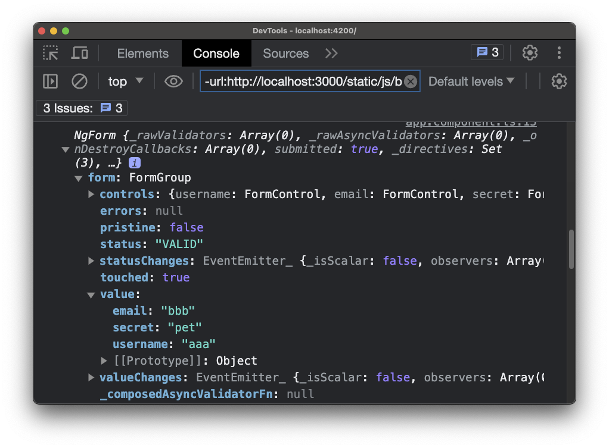

# 04. (TD) Submitting and Using the Form

在上一堂課中，我們配置了我們的表單並使用 ngModel 指令在輸入框中添加了控制項。 現在，讓我們使表單可提交，以便我們可以查看使用者輸入的內容。

## 1. Declaring the `onSubmit()` Method

首先我們要在 [`app.component.ts`](../../forms-td-app/src/app/app.component.ts) 中，建立一個名為 `onSubmit()` 的新方法。 當使用者提交表單時，此方法將被觸發：

- [`app.component.ts`](../../forms-td-app/src/app/app.component.ts)

```diff
...
export class AppComponent {
  suggestUserName() {
    const suggestedName = 'Superuser';
  }

+ onSubmit() {
+   // TODO
+ }
}
```

## 2. Using `ngSubmit` to Handle Form Submission

為了在表單提交時調用 `onSubmit()` 方法，我們將使用 Angular 提供的 `ngSubmit` 指令。 將 `ngSubmit` 指令添加到模板中的 `<input>` 元素中，並將 `onSubmit()` 方法作為事件處理器傳遞：

- [`app.component.html`](../../forms-td-app/src/app/app.component.html)

```diff
<div class="container">
  <div class="row">
    <div class="col-xs-12 col-sm-10 col-md-8 col-sm-offset-1 col-md-offset-2">
-     <form>
+     <form (ngSubmit)="onSubmit()">
        ...
      </form>
    </div>
  </div>
</div>
```

## 3. Adding Local Reference to the Form

為了訪問 Angular 創建的表單物件，我們將在模板中的 `<form>` 元素上使用一個本地參考。 將一個參考變數（例如 `#f` ）添加到 `<form>` 元素中：

- [`app.component.html`](../../forms-td-app/src/app/app.component.html)

```diff
<div class="container">
  <div class="row">
    <div class="col-xs-12 col-sm-10 col-md-8 col-sm-offset-1 col-md-offset-2">
-     <form (ngSubmit)="onSubmit()">
+     <form (ngSubmit)="onSubmit()" #f>
        ...
      </form>
    </div>
  </div>
</div>
```

```html
<form _ngcontent-vmj-c44="" novalidate="" class="ng-untouched ng-pristine ng-valid ng-submitted">...</form>
```

但這樣做其實會把原生的 HTML `<form>` 元素傳給 `onSubmit()` 方法，而不是 Angular 創建的 JavaScript 表單物件。 為了解決這個問題，我們應該這樣做：

- [`app.component.html`](../../forms-td-app/src/app/app.component.html)

```diff
<div class="container">
  <div class="row">
    <div class="col-xs-12 col-sm-10 col-md-8 col-sm-offset-1 col-md-offset-2">
-     <form (ngSubmit)="onSubmit()" #f>
+     <form (ngSubmit)="onSubmit()" #f="ngForm">
        ...
      </form>
    </div>
  </div>
</div>
```



## 4. Passing the Local Reference to the `onSubmit()` Method

將參考變數 `#f` 作為參數傳遞給 `onSubmit()` 方法，並將 `onSubmit()` 方法的定義更改為接受一個 `NgForm` 類型的參數，並將參數命名為 `form` 輸出：

- [`app.component.html`](../../forms-td-app/src/app/app.component.html)

```diff
```diff
<div class="container">
  <div class="row">
    <div class="col-xs-12 col-sm-10 col-md-8 col-sm-offset-1 col-md-offset-2">
-     <form (ngSubmit)="onSubmit()" #f="ngForm">
+     <form (ngSubmit)="onSubmit(f)" #f="ngForm">
        ...
      </form>
    </div>
  </div>
</div>
```

- [`app.component.ts`](../../forms-td-app/src/app/app.component.ts)

```diff
...
+ import { NgForm } from '@angular/forms';

@Component({
  selector: 'app-root',
  templateUrl: './app.component.html',
  styleUrls: ['./app.component.css']
})
export class AppComponent {
  suggestUserName() {
    const suggestedName = 'Superuser';
  }

- onSubmit() {
+ onSubmit(form: NgForm) {
    console.log(form);
  }
}
```

## Testing the Form Submission

保存更改並重新編譯。 現在，當您提交表單並在 input 欄位中輸入值時，您應該在控制台中看到 `ngForm` 物件的資訊。 `ngForm` 物件包含各種屬性，例如 value，其中保存著代表使用者輸入的鍵值對。


遵循這些步驟，您可以使 Angular 中的模板驅動表單可提交並訪問由 Angular 創建的表單物件。 `NgForm` 物件提供了訪問表單數據的方法，包括使用者輸入的值。