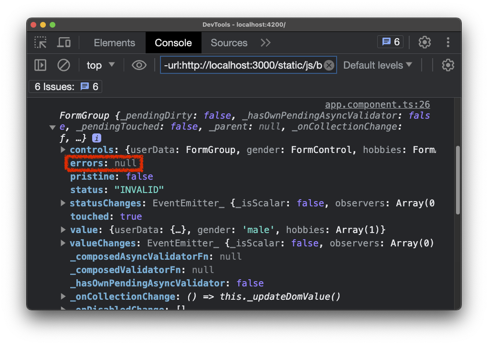
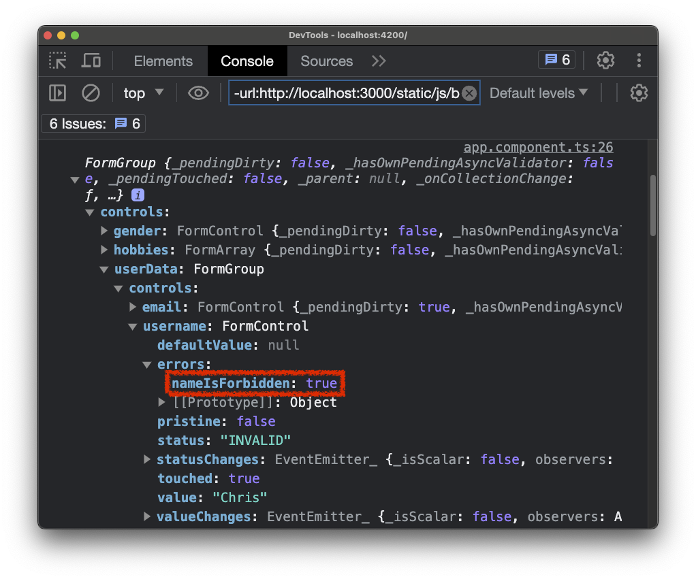

# 25. (Reactive) Using Error Codes

在上一小節中，我們添加了自己的驗證器，現在讓我們進一步探索 Error codes。

目前，表單無效，該欄位和整個表單都被標記為 `"INVALID"`。但是，我仍然可以提交表單，因為我們尚未禁用按鈕。

為了理解 Error codes，讓我們檢查表單上的 `errors` 屬性，我們可以發現它為 `null`：



但是，如果我們檢查控制項 `userData` 然後是 `username`，我們會在 `errors` 下找到 `nameIsForbidden` 的值為 `true`：



這才是 Angular 真正在 `errors` 物件中為個別控制項添加 error codes 的地方。

我們可以利用這一點，在 HTML 程式碼中進一步調整錯誤訊息。 例如，如果該欄位為空，我們希望顯示一個訊息，指出使用者名稱為必填項目。 如果使用者名稱無效，我們希望顯示一個訊息指出它是一個無效的使用者名稱。

為了達到這個目的，我們可以將錯誤訊息包裝在 `<span>` 元素中，並檢查：

1. `signUpForm.getUserData().userName.errors` 是否包含 `nameIsForbidden` 錯誤：如果包含，我們顯示訊息「This name is invalid!」
2. `signUpForm.getUserData().userName.errors` 是否包含 `required` 錯誤：如果包含，我們顯示訊息「The username is required!」

- [`app.component.html`](../../forms-reactive-app/src/app/app.component.html)

```diff
<div class="container">
  <div class="row">
    <div class="col-xs-12 col-sm-10 col-md-8 col-sm-offset-1 col-md-offset-2">
      <form [formGroup]="signupForm" (ngSubmit)="onSubmit()">
        <div formGroupName="userData">
          <div class="form-group">
            <label for="username">Username</label>
            <input
              type="text"
              id="username"
              formControlName="username"
              class="form-control">
            <span
              *ngIf="!signupForm.get('userData.username').valid && signupForm.get('userData.username').touched"
              class="help-block">
-             Please enter a valid username!
+             <span
+               *ngIf="signupForm.get('userData.username').errors['nameIsForbidden']">This name is invalid!</span>
+             <span
+               *ngIf="signupForm.get('userData.username').errors['required']">The username is required!</span>
            </span>
          </div>
          ...
        </div>
        ...
      </form>
    </div>
  </div>
</div>
```

有了這些修改：

- 如果我們點擊該欄位並在之後點擊其他地方，我們會看到「ＴThe username is required!」的錯誤訊息。 
- 如果我們在該欄位輸入「Anna」，我們會看到「This name is invalid!」的錯誤訊息。
- 如果我們輸入一個有效的使用者名稱，則不會顯示任何錯誤訊息。

這展示了我們如何利用這些 Error codes 。 當然，您還可以使用 `ngSwitch` 或其他適合您需求的方法。 關鍵概念是了解 Error codes 可用於顯示適當的錯誤訊息。 您甚至可以創建更複雜的設置，將 Error codes 映射到 TypeScript 程式碼中的特定訊息並動態輸出。