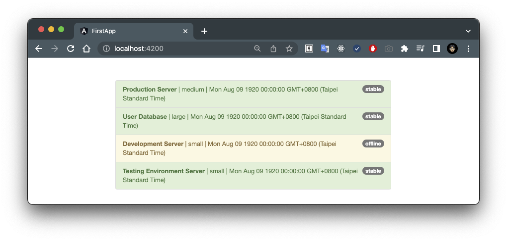
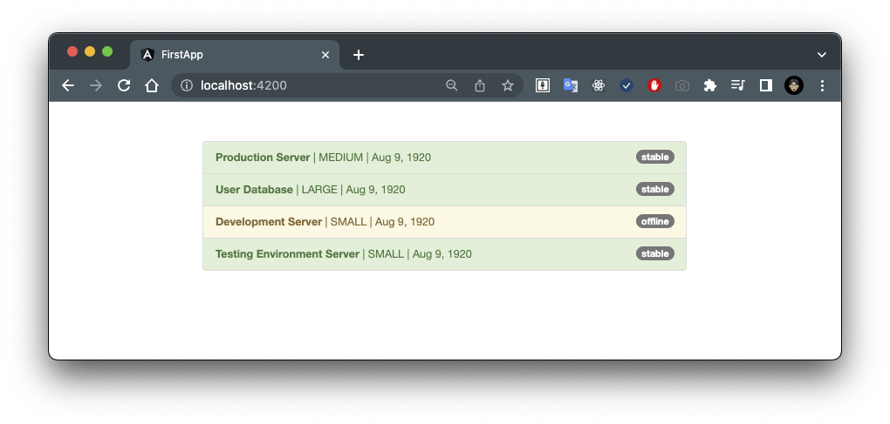

# 01. Using Pipes

## Using Pipes to Transform Output

- [`app.component.html`](../../pipes-app/src/app/app.component.html)

```diff
<div class="container">
  <div class="row">
    <div class="col-xs-12 col-sm-10 col-md-8 col-sm-offset-1 col-md-offset-2">
      <ul class="list-group">
        <li
          class="list-group-item"
          *ngFor="let server of servers"
          [ngClass]="getStatusClasses(server)">
          <span
            class="badge">
            {{ server.status }}
          </span>
          <strong>{{ server.name }}</strong> |
-         {{ server.instanceType }} |
+         {{ server.instanceType | uppercase }} |
-         {{ server.started }}
+         {{ server.started | date }}
        </li>
      </ul>
    </div>
  </div>
</div>
```

效果如下：

- Before



- After

