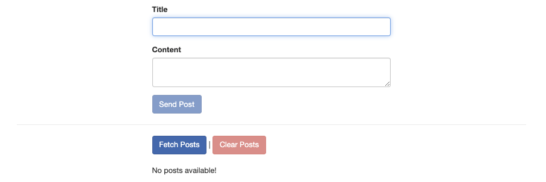

# 02. Sending a `POST` Request

## Project Setup

[HTTP APP](../../http-app/) 是我們的範例應用程式。 它提供了一個發文表單的介面：



## The `HttpClientModule` is Required

要發送 HTTP 請求，我們需要 `@angular/common/http` 中的 `HttpClientModule` ：

- [`app.module.ts`](../../http-app/src/app/app.module.ts)

```diff
import { BrowserModule } from '@angular/platform-browser';
import { NgModule } from '@angular/core';
import { FormsModule } from '@angular/forms';
+ import { HttpClientModule } from '@angular/common/http';

import { AppComponent } from './app.component';

@NgModule({
  declarations: [AppComponent],
- imports: [BrowserModule, FormsModule],
+ imports: [BrowserModule, FormsModule, HttpClientModule],
  providers: [],
  bootstrap: [AppComponent]
})
export class AppModule {}
```

## Injecting the `HttpClient` Service

接著我們必須注入 `HttpClient` 服務來透過它發送 HTTP 請求。

- [`app.component.ts`](../../http-app/src/app/app.component.ts)

```diff
import { Component, OnInit } from '@angular/core';
+ import { HttpClient } from '@angular/common/http';

@Component({
  selector: 'app-root',
  templateUrl: './app.component.html',
  styleUrls: ['./app.component.css']
})
export class AppComponent implements OnInit {
  loadedPosts = [];

- constructor() {}
+ constructor(private http: HttpClient) {}
  ...
}
```

## Sending a `POST` Request

而在 `onCreatePost()` 方法內，當我們接收到貼文資料時，我們將發送 HTTP 請求。

- [`app.component.ts`](../../http-app/src/app/app.component.ts)

```diff
...
export class AppComponent implements OnInit {
  loadedPosts = [];

  constructor(private http: HttpClient) {}

  ngOnInit() {}

  onCreatePost(postData: { title: string; content: string }) {
    // Send Http request
+   this.http.post(
+     'https://ng-complete-guide-1b8d7-default-rtdb.asia-southeast1.firebasedatabase.app/posts.json',
+     postData
+   );
  }
  ...
}
```

## Subscribing to the Response Data

因為 `post` 方法返回一個 Observable，我們還需要訂閱它以觸發請求：

- [`app.component.ts`](../../http-app/src/app/app.component.ts)

```diff
...
export class AppComponent implements OnInit {
  loadedPosts = [];

  constructor(private http: HttpClient) {}

  ngOnInit() {}

  onCreatePost(postData: { title: string; content: string }) {
    // Send Http request
    this.http.post(
      'https://ng-complete-guide-1b8d7-default-rtdb.asia-southeast1.firebasedatabase.app/posts.json',
      postData
    )
+   .subscribe(responseData => {
+     console.log(responseData);
+   });
  }
  ...
}
```

> **Note**:
> 在此範例中，Angular 的 `HttpClient` 會將 JavaScript 物件 `postData` 自動轉換為 JSON 格式的請求資料。 Angular 會自動添加必要的 Request headers，例如 `Content-Type`。

## Checking the Network Details

現在我們可以在瀏覽器的開發者工具中檢查 `Network` 發生了什麼事：

1. Request 1: `OPTIONAL /posts.json` 用來檢查伺服器是否允許我們發送 `POST` 請求。
   
2. Request 2: `POST /posts.json` 用來發送貼文資料。