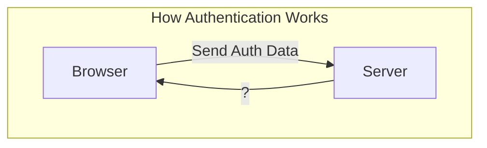
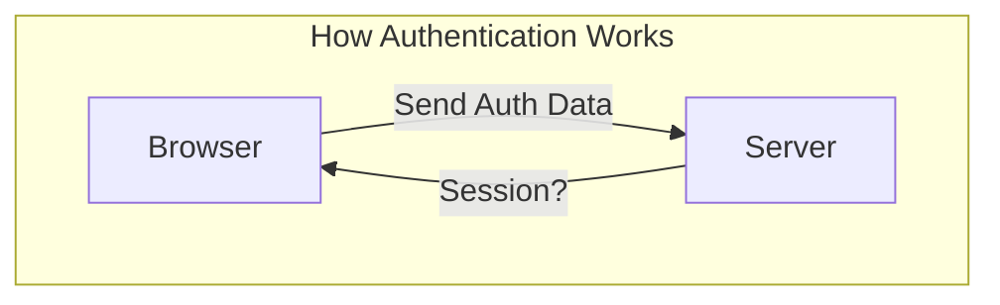
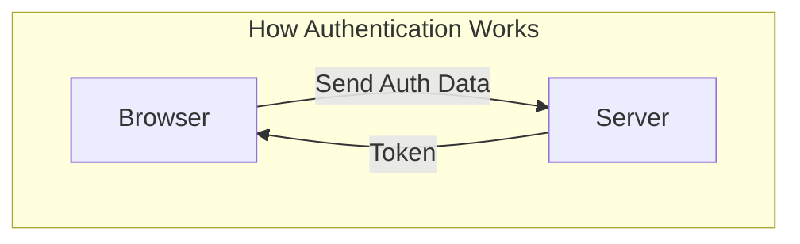
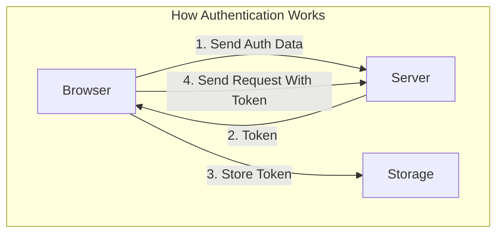

# 01. How Authentication Works

首先，我們當然需要了解身份驗證的工作原理。

這裡的意思並不是使用者必須輸入電子郵件和密碼進行登錄，而是指背後的技術工作原理。

為了理解這一點，我們可以思考一下我們的網頁應用程式或任何網頁應用程式的運作方式。

我們有一個客戶端，通常是瀏覽器，由使用瀏覽器的使用者使用，還有一個伺服器。

當使用者輸入他的憑證，即電子郵件和密碼時，這些身份驗證數據會被發送到一個伺服器進行驗證。

我們不能在瀏覽器中進行驗證，因為瀏覽器中的所有 JavaScript 程式碼都暴露給使用者，因此無法安全地存儲，而且邏輯也可能被更改，使用者可以編輯甚至禁用瀏覽器中的 JavaScript。

因此，我們可以利用這一點來創建良好的使用者體驗，根據身份驗證狀態來顯示應用程式的不同部分，但我們無法在瀏覽器中控制或驗證身份驗證狀態，這必須在伺服器端進行，因此在使用者無法干預的地方進行。

現在，如果你想到傳統的網頁應用程式，在那裡伺服器會為你輸入的不同 URL 渲染不同的 HTML 頁面，你會使用會話（session）來處理。但請記住，使用 Angular 我們建立的是單頁應用程式（SPA）。

這意味著我們將前端（Angular 應用程式）和後端解耦。我們訪問的不同頁面都由 Angular 及其路由器處理。

瀏覽器中的 JavaScript 接管並根據使用者的當前狀態重新渲染頁面或頁面的部分。

## RESTful API is Stateless

我們仍然可以像在 HTTP 模塊中學到的那樣，與後端進行通信，我們仍然可以與伺服器進行交互，但該伺服器將是一個符合 RESTful API 標準的伺服器，因此我們將不使用會話，因為 RESTful API 是無狀態的，對於 GraphQL API 也是如此。

核心問題是我們的後端，我們的伺服器將是一個 API。

它不會是一個渲染我們所在的 HTML 頁面的伺服器，因此無法使用會話，因為我們的伺服器不關心客戶端。客戶端和伺服器端是解耦的，它們通過 Angular 提供的 HttpClient 進行通信，但除此之外，沒有其他連接，伺服器不知道我們的客戶端。因此，會話不是解決方案，會話將存儲在伺服器端，正如我剛才提到的，伺服器不關心我們的客戶端。

## JSON Web Token

相反，我們將使用一種不同的方法，伺服器將驗證使用者的電子郵件和密碼，如果所有數據有效，伺服器將向客戶端發送一個 Token ，通常是 JSON Web Token。這是一個包含許多元數據的編碼字串，該字串經過編碼而不是加密，這很重要，這意味著該字串可以被解析並由客戶端讀取。

更重要的是，該字串，即 Token 是在伺服器上使用特定演算法和特定私鑰生成的，只有伺服器才知道，只有伺服器能夠驗證傳入的 Token 的有效性。 而客戶端，也就是我們的 Angular 應用程式會將該 Token 存儲在某種存儲機制中，例如瀏覽器的 local storage。並將該 Token 附加到任何需要身份驗證的後續請求上。

所以假設我們需要進行身份驗證才能存儲資源，那麼我們需要將該 Token 附加到發送到伺服器的請求中，可以將其放在 request header 中或作為 request parameter。

現在，伺服器能夠驗證該 Token ，因為伺服器使用特定演算法和特定私鑰生成了該 Token ，該私鑰只有伺服器知道，這就是 Token 的安全性所在。我們無法在客戶端生成或編輯 Token ，因為一旦我們這樣做，它將不符合伺服器上使用的演算法和私鑰，伺服器因此能夠確定該 Token 無效，並因此阻止訪問。

這就是為什麼這是安全的，因為伺服器知道比客戶端更多，但我們給客戶端一個重要的片段，用於驗證後續請求，但該片段是由伺服器提供的，無法在客戶端生成，因為我剛才說過的安全原因。

現在我們已經了解了理論，如果我們開始實際實現，這將變得更清楚，當然，這始於提供一個 UI，讓使用者可以輸入其憑證，註冊和登錄，然後，我們將逐步添加創建這樣一個 Token 的邏輯，存儲這樣一個 Token ，將這樣一個 Token 附加到請求等等的邏輯。